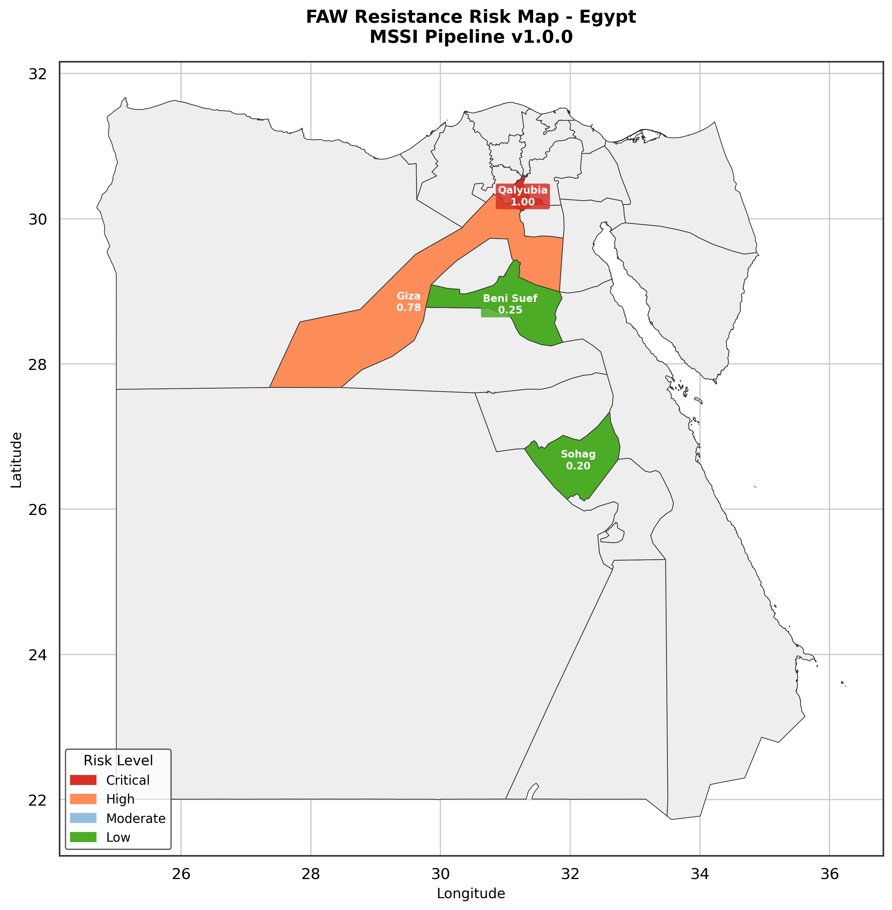
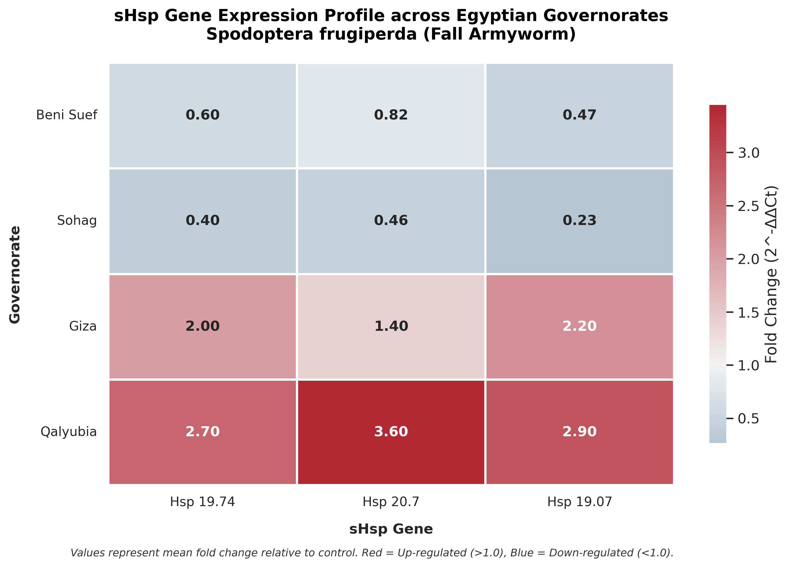
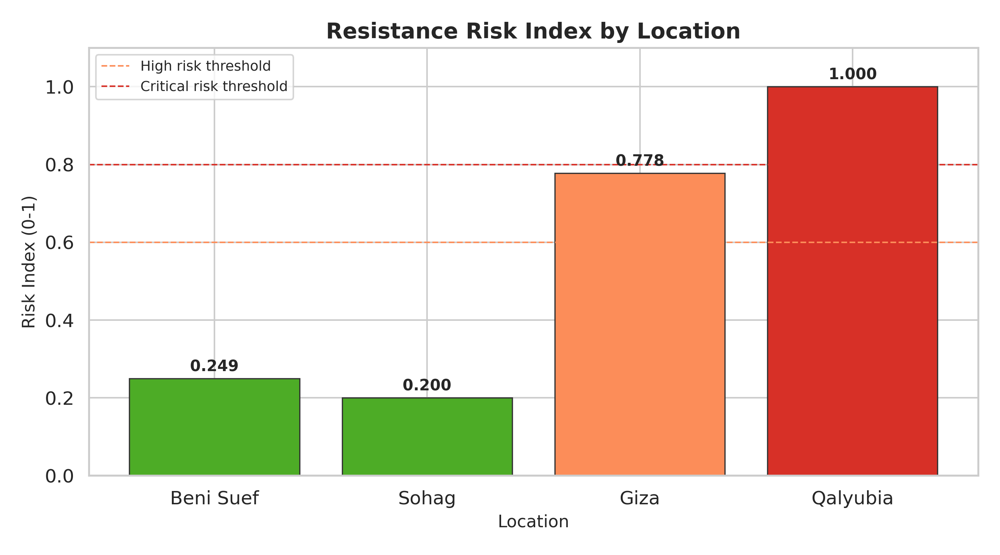
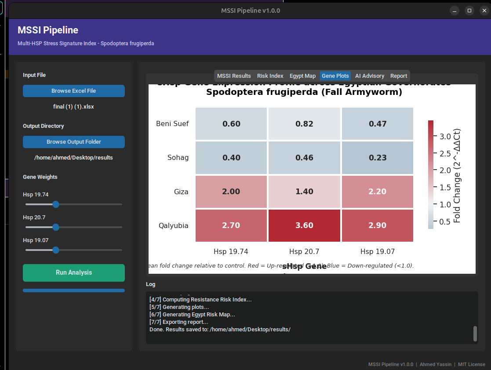

# MSSI Pipeline: A Computational Framework for Multi-HSP Stress Signature Indexing in *Spodoptera frugiperda*

| Role | Name                          | Affiliation                    |
|------|-------------------------------|--------------------------------|
| **Lead Developer** | Ahmed Yassin, MSc             | Computational Biologist -  peking university    |
| **Supervisor** | Dr. Etr H. K. Khashaba, PhD   | Plant Protection Research Institute (PPRI), ARC |
| **Supervisor** | Dr. Amany M. Abd El Azim, PhD | Plant Protection Research Institute (PPRI), ARC |

---

# Abstract

The Multi-HSP Stress Signature Index (MSSI) Pipeline is a computational bioinformatics framework developed to quantify physiological stress responses in the Fall Armyworm (*Spodoptera frugiperda*) through the integration of multiple small Heat Shock Protein (sHsp) expression biomarkers.

The framework transforms multidimensional gene-expression measurements into a unified quantitative stress metric capable of supporting molecular diagnostics, resistance monitoring, and decision-making processes in agricultural pest management.

By integrating weighted biomarker expression profiles, automated stress classification, resistance-risk assessment, geographic visualization, and publication-ready reporting, the MSSI Pipeline bridges the gap between molecular biology and practical Integrated Pest Management (IPM) applications.

---

# Scientific Background and Research Problem

The Fall Armyworm (*Spodoptera frugiperda*) is among the most destructive invasive agricultural pests worldwide. Continuous exposure to insecticides, environmental fluctuations, temperature extremes, and agricultural interventions induces complex molecular stress responses involving multiple stress-regulated genes.

Traditional gene-expression studies typically evaluate individual genes independently. While such approaches provide valuable biological insights, they often fail to capture the integrated physiological state of an organism because adaptive responses emerge from coordinated gene networks rather than isolated transcriptional events.

The MSSI Pipeline was developed to address these limitations by transforming complex transcriptional profiles into an interpretable systems-level stress indicator.

---

# Conceptual Framework

The MSSI framework is based on the hypothesis that physiological stress cannot be accurately represented by a single biomarker gene.

Instead, stress is treated as an emergent biological property resulting from the collective behavior of multiple stress-responsive genes.

The pipeline integrates:

- Relative gene-expression measurements obtained from qRT-PCR.
- Gene-specific biological importance weights.
- Population-level transcriptional signatures.
- Statistical normalization procedures.
- Automated classification algorithms.
- Resistance-risk inference models.
- Geographic visualization systems.

---

# Mathematical Framework

## Multi-HSP Stress Signature Index (MSSI)

The core analytical metric of the framework is the Multi-HSP Stress Signature Index (MSSI):

$$MSSI = \frac{\sum_{i=1}^{n} (w_i \times FC_i)}{n}$$


Where:

- **FCᵢ** = relative fold-change expression value of biomarker gene *i*
- **wᵢ** = biological significance coefficient assigned to gene *i*
- **n** = total number of genes within the biomarker panel

Higher MSSI values indicate stronger collective activation of stress-response pathways and potentially elevated adaptive pressure.

## Resistance Risk Index (RRI)

The framework computes a Resistance Risk Index (RRI) by integrating:

- Normalized MSSI values
- Gene-expression consensus
- Stress intensity measurements
- Confidence estimation

The resulting score ranges from **0.0 to 1.0**, enabling population-level risk stratification.

---

# Why the MSSI Framework is Novel

Unlike conventional workflows that interpret genes independently, the MSSI framework introduces a systems-level diagnostic methodology.

Key innovations include:

- Multi-gene integration instead of single-gene interpretation.
- Weighted biological significance scoring.
- Automated resistance-risk assessment.
- Geographic risk visualization.
- Publication-ready visual analytics.
- Direct support for Integrated Pest Management (IPM).

---

# Core Features

## Molecular Analysis

- Multi-gene expression integration
- Weighted biomarker evaluation
- Fold-change analysis
- Automated normalization

## Stress Classification

- Very High Stress
- High Stress
- Moderate Stress
- Low Stress

## Resistance Risk Assessment

- Resistance Risk Index (RRI)
- Risk category assignment
- Recommended management actions

## Visual Analytics

- Publication-quality heatmaps
- Comparative expression plots
- Risk-index visualizations
- Geographic distribution maps

## Automated Reporting

- PDF reports
- JSON summaries
- Publication-ready figures

---

# Visual Outputs

## Geographic Resistance Risk Mapping



## Comparative Gene Expression Heatmap



## Resistance Risk Stratification



## Interactive Decision-Support Interface



---

# Installation

Install directly from PyPI:

```bash
pip install mssi-pipeline
```

Verify installation:

```bash
mssi --help
```

---

# Launching the Pipeline

```bash
mssi run
```

The graphical interface allows researchers to:

- Load Excel-based expression datasets
- Configure gene-specific weights
- Compute MSSI scores
- Generate resistance-risk assessments
- Visualize spatial distributions
- Export publication-ready reports

---

# Input Data Requirements

The pipeline expects Microsoft Excel files containing:

- Gene-specific worksheets
- Fold-change values
- Biological replicates
- Population identifiers

Each worksheet represents a single biomarker gene within the stress-signature panel.

---

# Applications

- Insecticide resistance monitoring
- Molecular ecology studies
- Population stress surveillance
- Agricultural decision support
- Integrated Pest Management (IPM)
- Comparative biomarker research
- Bioinformatics-based diagnostics

---

# Future Research Directions

## Machine Learning Integration

- Random Forest
- Support Vector Machines
- Gradient Boosting

## Multi-Species Expansion

Extension of the framework to additional agricultural pests through configurable biomarker panels.

## Environmental Data Integration

Integration of climatic and satellite-derived environmental variables.

## Cloud-Based Comparative Analytics

Development of centralized repositories enabling large-scale comparative studies.

---

# Citation

If you use the MSSI Pipeline in your research, please cite:

> Yassin, A.E., Khashaba, E.H.K., Abd El Azim, A.M.  
> MSSI Pipeline: A Computational Framework for Multi-HSP Stress Signature Indexing in *Spodoptera frugiperda*.

---

# Author

**Ahmed Elsayed Yassin, MSc**

Computational Biologist | Bioinformatics Researcher | Python Developer

GitHub: https://github.com/AHMEDY3DGENOME

---

# License

This project is released under the MIT License.